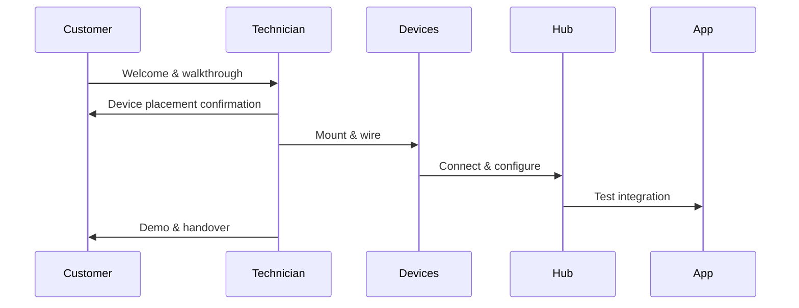

## Booking Installation Appointments Online

CHALAAD makes booking professional installation straightforward through your customer dashboard at `https://dashboard.chalaad.com`. Follow these steps to schedule a visit tailored to your smart home needs.

<Steps>
  <Step title="Create Account" icon="user">
    Sign up or log in to your CHALAAD account. Verify your email to unlock booking features.
  </Step>
  <Step title="Select Devices" icon="package">
    Choose the smart devices you've purchased, such as Philips Hue lights or Nest thermostats. Add quantities and rooms for accurate quoting.
  </Step>
  <Step title="Pick Date and Time" icon="calendar">
    View available slots based on your location. Slots fill quickly, so book at least 48 hours in advance.
  </Step>
  <Step title="Confirm and Pay" icon="credit-card">
    Review the quote (starting at `$99` for basic setups) and complete payment. You'll receive a confirmation email with technician details.
  </Step>
</Steps>

<Callout kind="tip">
  New customers get a `10%` discount on first installations. Enter promo code `WELCOME10` at checkout.
</Callout>

## Preparing Your Home for Installation

Prepare your space to ensure a smooth process. Technicians arrive with all tools, but your readiness minimizes delays.

- Clear workspaces around installation sites, like walls for smart switches or ceilings for cameras.
- Ensure stable Wi-Fi (`>50Mbps` recommended) and provide network credentials.
- Test outlets with a voltage tester; report any issues beforehand.
- Keep pets secured during the `2-4 hour` visit.

<Callout kind="alert">
  Label wires if retrofitting existing setups to avoid confusion.
</Callout>

## What to Expect During Installation

Our certified technicians handle everything from mounting to integration. Use the dashboard to track progress in real-time.

<Tabs>
  <Tab title="Small Home (1-3 Devices)" icon="home">
    Expect `1-2 hours`. Focus on hub setup and basic automations like motion-activated lights.
  </Tab>
  <Tab title="Full Smart Home (10+ Devices)" icon="smart-home">
    `3-5 hours` including custom scenes for security and energy savings.
  </Tab>
  <Tab title="Enterprise Setup" icon="building">
    Multi-day for commercial spaces with advanced zoning and failover systems.
  </Tab>
</Tabs>

<Columns cols={2}>
  <Card title="Included Services" icon="check-circle">
    - Device mounting and wiring
    - App configuration
    - Basic automation rules
  </Card>
  <Card title="Optional Add-ons" icon="plus" href="#add-ons">
    - Extended warranty
    - Custom voice integrations
    - 24/7 monitoring setup
  </Card>
</Columns>

## Post-Installation Troubleshooting and Maintenance

After installation, monitor via the CHALAAD app. Most issues resolve with simple resets.

<ExpandableGroup>
  <Expandable title="Device Not Responding" default-open="true">
    1. Restart the hub via app.
    2. Check Wi-Fi signal strength.
    3. Contact support at `support@chalaad.com` with error logs.
  </Expandable>
  <Expandable title="Automation Failures">
    Verify rule conditions in the dashboard. Recalibrate sensors if humidity affects performance.
  </Expandable>
  <Expandable title="Firmware Updates">
    Enable auto-updates in settings. Schedule maintenance visits annually for optimal performance.
  </Expandable>
</ExpandableGroup>

<Callout kind="success">
  All installations include `30 days` of free support. Book follow-ups directly in your dashboard.
</Callout>

For advanced configurations, explore our [Quickstart Guide](/quickstart) or contact support for personalized assistance.